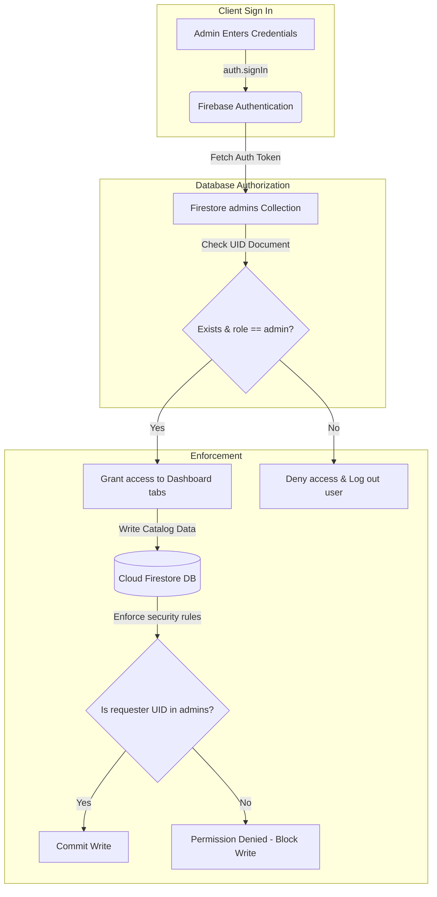

# Implementation Plan: Secure Database-Driven Admin Authorization

This plan outlines the implementation of a secure, database-driven admin authorization system for **Laptopkart**. Instead of hardcoding admin emails in the client-side code, we will store authorized administrator roles in a dedicated Firestore collection (`admins`) and enforce access permissions both in the Admin Dashboard UI and directly via Firestore Security Rules.

---

## 🏗️ Architectural Overview



---

## 🗄️ Database Schemas & Collections

### 1. Admins Collection (`admins`)
*   **Document ID**: Mapped to the administrator's Firebase Auth **UID** (`doc(db, "admins", user.uid)`).
*   **Document Schema**:
```json
{
  "email": "laptopkart.official@gmail.com",
  "name": "Sudarsan Kumar",
  "role": "admin",
  "createdAt": "2026-07-11T16:00:00Z"
}
```

---

## 🛡️ Strict Firestore Security Rules

To secure the database against unauthorized API calls, we will enforce security rules at the database level:

```javascript
rules_version = '2';
service cloud.firestore {
  match /databases/{database}/documents {
    
    // Helper function to check if the authenticated user exists in the 'admins' collection
    function isAdmin() {
      return request.auth != null && 
        exists(/databases/$(database)/documents/admins/$(request.auth.uid));
    }

    // Products Catalog
    match /products/{productId} {
      allow read: if true;
      allow write: if isAdmin();
    }

    // Accessories Catalog
    match /accessories/{accessoryId} {
      allow read: if true;
      allow write: if isAdmin();
    }

    // Banners & Offers
    match /banners/{bannerId} {
      allow read: if true;
      allow write: if isAdmin();
    }

    // Orders Registry (Anyone can place orders during checkout, only admins read/update)
    match /orders/{orderId} {
      allow create: if true;
      allow read, write: if isAdmin();
    }

    // Admins Collection (Only admins can view or modify other admins)
    match /admins/{adminId} {
      allow read, write: if isAdmin();
    }

    // User Profiles (Customers read/write their own shipping/contact info)
    match /users/{userId} {
      allow read, write: if request.auth != null && request.auth.uid == userId;
    }
  }
}
```

---

## 🚀 Proposed Changes

### 1. Admin Dashboard ([App.tsx](file:///c:/Users/sudarsan%20kumar/OneDrive/Desktop/Laptopkart/laptopkart/admin/src/App.tsx))
*   Modify `useEffect` auth listener to execute a Firestore read:
    `getDoc(doc(db, "admins", user.uid))`
*   If the document exists and has `role === 'admin'`, save user state and mount dashboard.
*   Otherwise, show a detailed error: *"Access Denied: This account is not registered as an authorized administrator."* and automatically sign them out.
*   **Offline Development Fallback**: If the browser returns an API configuration error (indicating mock credentials for offline environments), fallback to letting developers testing locally pass the login wall.

---

## 📈 Verification Plan

### Manual Verification
1.  Add a document in the `admins` collection where the ID matches your email's Firebase Auth UID.
2.  Try signing in on the Admin Dashboard using that email account (either manual or Google login) and verify dashboard access is granted.
3.  Sign out, then try signing in with a standard customer email account (not in the `admins` collection). Verify the dashboard locks them out with an *"Access Denied"* alert.
4.  Verify Firestore Security Rules by temporarily bypassing the dashboard UI (e.g. trying to write directly from code with a customer account) and confirming Firebase rejects the API call with `permission-denied`.
